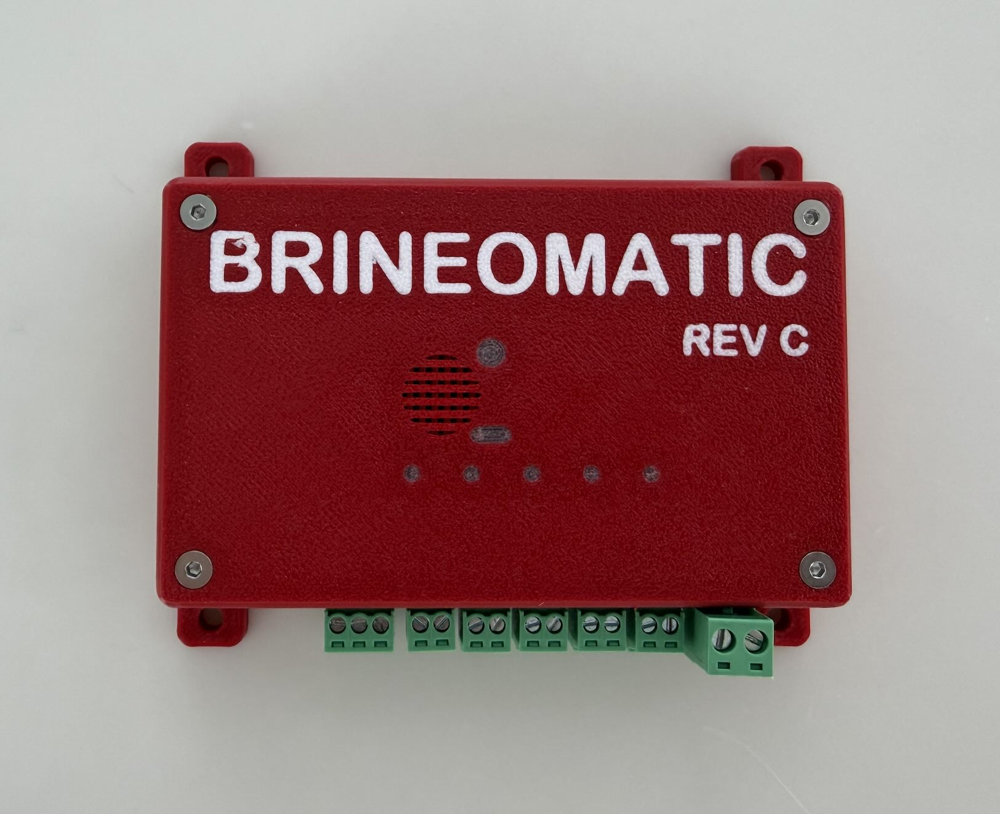

# Open Hardware Watermaker Controller

Brineomatic is an open-hardware, open-firmware watermaker controller that fully automates a marine reverse-osmosis watermaker. Designed for DIY, builders, and cruising sailors, it provides **full cycle automation**, **robust safety checks**, and **modern web-based control**.  All of this while remaining easy to service, modify, and adapt to nearly any watermaker—including Rainman, DIY builds, and traditional AC pump systems.

Built on the **ESP32-S3**, Brineomatic integrates pressure sensors, flow meters, temperature sensing, and salinity monitoring with intelligent control of pumps, valves, and a high-pressure valve stepper motor. It automates the entire operating lifecycle: production runs, freshwater flushes, safety shutdowns, and chemical pickling/depickling.

While Brineomatic is a robust controller board, boats are boats, and things break.  We have a design philosophy of **failing gracefully**.  The hardware and software is designed so that every single sensor and actuator can by bypassed into manual mode with graceful degradation of functionality. If one minor thing on your watermaker breaks, it shouldn't take down the whole system.  You should be able to bypass it and continue the essential process of making water.

## Automation
- Automatic run cycles  
- Time-based, volume-based, or tank fill production  
- Automatic freshwater flush (time / volume / salinity modes)  
- Full pickling + depickling sequences  
- Manual mode for direct hardware testing and setup

## Safety
Brineomatic continuously monitors critical values and stops safely on failure:
- High/low membrane pressure  
- High/low filter pressure  
- High product salinity  
- Low product/brine flowrate  
- Low total flowrate (combined)  
- Diverter valve closed failure  
- Motor over-temperature  
- Flush valve stuck open  
- Low Battery
- Low Tank Level (flushing)
- Comprehensive timeout handling

## User Interface
- Local HTML5 web interface served directly from the ESP32  
- Fast, mobile-friendly design  
- Works on phones, laptops, and supported MFDs  
- Real-time dashboard with flow, pressure, salinity, temperature, and tank level  
- Full configuration editor - no editing config files  
- Optional sound notifications (success/error melodies)  

## Integrations
- MQTT publishing
- SignalK 
- Home Assistant
- HTTP/REST endpoints  
- WebSocket real-time control

### Example User Interface

### Hardware 
